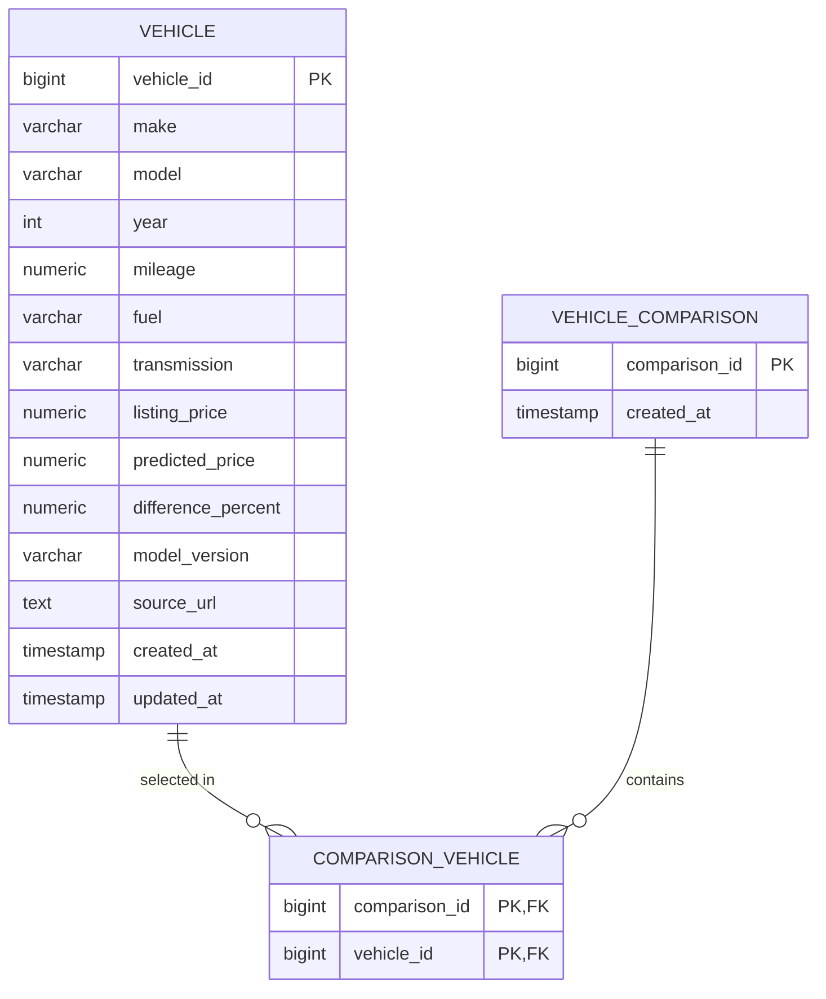

# ERD — Increment 1

The workflow explicitly requires PostgreSQL and the system contains vehicle listing,
pricing/prediction, recommendation and comparison concepts. The following ERD is
the proposed foundation model; it must be reviewed against the actual Spring Boot
entities before implementation.

## Relationship
- One comparison contains multiple selected vehicles.
- One vehicle can participate in multiple comparisons.
- `comparison_vehicle` resolves the many-to-many relationship.

## Not yet fixed by the workflow
- User/account entity
- Recommendation persistence
- Raw/clean staging tables
- Exact crawler-source entity
- Exact authentication model
