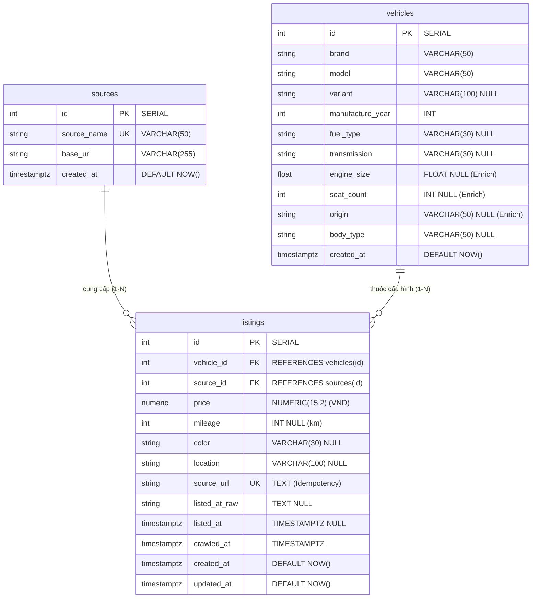

# Entity Relationship Diagram (ERD) - PostgreSQL Schema v2.0.0

- **Phiên bản:** 2.0.0
- **Chủ sở hữu:** TV5 (Review & Đồng bộ: TV1, TV3, TV4)
- **Ngày cập nhật:** 15/09/2026
- **Trạng thái:** Thiết kế chính thức cho Increment 2

Tài liệu này mô tả Sơ đồ Quan hệ Thực thể (ERD), cấu trúc liên kết khóa chính/khóa ngoại và các quy tắc định danh dữ liệu áp dụng cho PostgreSQL Database trong Increment 2.

---

## 1. Sơ đồ Quan hệ (Mermaid ERD)

---

## 2. Chi tiết Thực thể & Quan hệ Hệ thống

### 2.1 Thực thể `sources` (Nguồn dữ liệu)
- **Vai trò:** Quản lý danh mục các sàn giao dịch/nguồn cào dữ liệu (VD: `Bonbanh`, `Chotot`).
- **Quan hệ:** One-to-Many ($1 - N$) với `listings`. Một nguồn có thể phát sinh nhiều tin rao bán.

### 2.2 Thực thể `vehicles` (Cấu hình kỹ thuật xe)
- **Vai trò:** Đại diện cho một tập hợp thông số kỹ thuật xe quan sát được trên thị trường.
- **Quan hệ:** One-to-Many ($1 - N$) với `listings`. Một cấu hình xe có thể có nhiều bài rao bán khác nhau từ nhiều người bán/sàn khác nhau.

### 2.3 Thực thể `listings` (Tin rao bán thị trường)
- **Vai trò:** Thực thể trung tâm lưu trữ dữ liệu biến động thị trường (giá bán, kilomet thực tế, màu sắc, vị trí bài đăng, thời gian cào).
- **Quan hệ:** Phụ thuộc vào `vehicles` (`vehicle_id`) và `sources` (`source_id`).

---

## 3. Quy tắc Kiến trúc & Định danh (Business Rules)

1. **Quy tắc Định danh Cấu hình Xe (`vehicles` Identity):**
   - Một dòng trong `vehicles` đại diện cho một thông số xe quan sát được.
   - Khi tiến hành Import (TV3), hệ thống thực hiện khớp nối cấu hình dựa trên tổ hợp thuộc tính:
     $$\text{Composite Key} = (\text{brand}, \text{model}, \text{variant}, \text{manufacture\_year}, \text{fuel\_type}, \text{transmission}, \text{engine\_size})$$
   - Nếu tìm thấy bộ thông số trùng khớp $\rightarrow$ Gán `vehicle_id` có sẵn. Nếu chưa có $\rightarrow$ Khởi tạo dòng mới trong `vehicles`.

2. **Chống trùng lặp & Chạy lại Import (Idempotency Strategy):**
   - Trường `listings.source_url` là **Duy nhất (`UNIQUE`)**.
   - Khi chạy lại pipeline import cùng một tập dữ liệu, câu lệnh `UPSERT` (PostgreSQL `ON CONFLICT (source_url) DO UPDATE`) sẽ cập nhật các trường biến động (`price`, `mileage`, `crawled_at`, `updated_at`) chứ không chèn thêm dòng mới.

3. **Chiến lược Bắt buộc / Cho phép Null (Nullability & Integration):**
   - Các trường **Bắt buộc (`NOT NULL`)**: `brand`, `model`, `manufacture_year`, `price`, `source_url`, `crawled_at`. Đây là các trường dữ liệu cốt lõi phục vụ hiển thị và tìm kiếm.
   - Các trường **Cho phép Null (`NULL`)**: `origin`, `engine_size`, `seat_count` (các trường Enrich), `mileage`, `variant`, `color`, `location`. Việc thiếu dữ liệu từ nguồn cào không làm bẻ gãy ràng buộc dữ liệu toàn vẹn của Database.

---

## 4. Định hướng Mở rộng cho Increment 3 (Extensibility)

Cấu trúc Schema v2.0.0 được thiết kế sẵn khả năng mở rộng mà không làm thay đổi các bảng hiện tại:
- **Dự đoán giá (ML Prediction):** Kết quả dự đoán giá và Metadata mô hình sẽ được lưu ở bảng riêng (`predictions`), liên kết tới `listings.id` hoặc `vehicles.id` qua khóa ngoại. Không ghi đè giá dự đoán vào cột `listings.price`.
- **So sánh & Gợi ý (Comparison & Recommendation):** Tách riêng bảng `vehicles` giúp việc truy vấn so sánh 2 cấu hình xe diễn ra nhanh chóng thông qua `vehicle_id`.