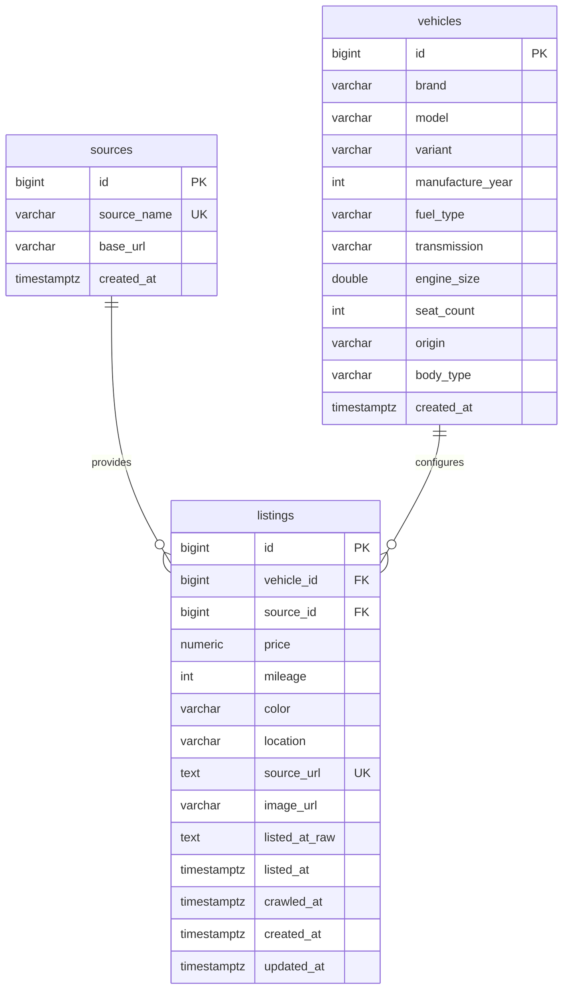

# Entity Relationship Diagram - PostgreSQL Schema v2.0.1

Owner: TV5. Status: official Increment 2 schema, pending runtime import and Backend integration verification.

## Rules

- `vehicles` represents an observed vehicle configuration. A listing is linked using the documented configuration attributes and null-safe matching; matching brand/model alone never proves the same vehicle.
- `listings.source_url` is the unique listing identity for idempotent import. A repeated import updates mutable listing values instead of creating a duplicate listing.
- `image_url` belongs to `listings`, because it is media for a specific market listing rather than a permanent vehicle specification.
- `listed_at_raw` preserves the source string. `listed_at` remains NULL until the value can be parsed and verified; `crawled_at` is the reliable observation timestamp.
- `color` is an optional extension field and is not part of the current 17-field TV3 dataset.

Future prediction, recommendation, and comparison tables will be added in later increments. Prediction values must not overwrite `listings.price`.
