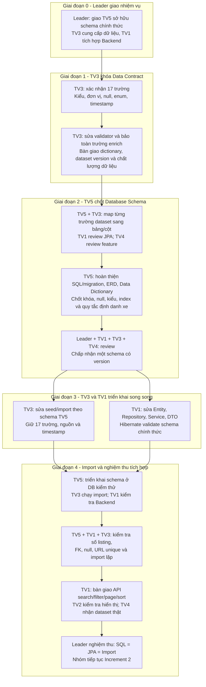

# Emergency Mission - Thống nhất Database cho Increment 2

Ngày giao nhiệm vụ: 14/09/2026. Trạng thái: **ĐANG THỰC HIỆN**.

Tài liệu này ghi các nhiệm vụ cấp thiết do leader điều phối. Nhiệm vụ hiện tại là thống nhất Data Contract, PostgreSQL schema, seed/import và JPA trước khi tích hợp dữ liệu thị trường vào Increment 2. Các thành viên cập nhật tiến độ và bằng chứng hoàn thành trong báo cáo cá nhân; leader cập nhật trạng thái tại đây sau khi nghiệm thu.

## 1. Quy trình theo giai đoạn

# Tổng quát quá trình: 

1. TV3 đọc cả hai file TV3_dataset_handoff_review.md và emergency_mission.md , rồi thực hiện Giai đoạn 1 trong emergency_mission: khóa Data Contract 17 trường, sửa validator/pipeline và bàn giao mapping cho TV5.
2. TV5 dùng Data Contract của TV3 cùng các phát hiện trong dataset_handoff_review để chốt SQL, ERD, Data Dictionary và mapping chính thức.
3. TV1 review schema trong lúc chờ, sau đó sửa JPA khi TV5 công bố schema đã được nhóm chấp nhận.
4. TV4 kiểm tra feature model, unit, nullable và bảo đảm các trường ML được giữ trong database.
5. TV2 chờ API contract từ TV1 rồi tích hợp giao diện.

Giai đoạn 1, TV3 khóa **schema dữ liệu đầu vào**, không phải schema database. Giai đoạn 2 do TV5 chủ trì. TV5 có thể khảo sát thiết kế và TV1 có thể lập danh sách chênh lệch ngay trong giai đoạn 1; việc sửa import/JPA theo bản chính thức bắt đầu sau khi giai đoạn 2 được chấp nhận.

Không cần chờ TV3 cào thêm để thống nhất schema hoặc triển khai Increment 2. Các trường thiếu tự nhiên được lưu null. Enrichment phục vụ model tiếp tục theo nhiệm vụ riêng của TV3/TV4.

## 2. Nguyên tắc chung

- TV5 sở hữu `database/` và tài liệu thiết kế database. Schema/migration do TV5 công bố và được nhóm review là nguồn chuẩn duy nhất.
- TV3 sở hữu crawler, Data Contract, validation và seed/import. TV1 sở hữu JPA, Backend và API. TV4 xác nhận feature model; TV2 nhận API contract.
- Giữ tên trường thống nhất: `brand`, `model`, `variant`, `manufacture_year`, `fuel_type`, `transmission`, `price`. TV5 chốt tên bảng và tên khóa một lần trong dictionary.
- Giữ `origin`, `engine_size`, `seat_count` trong database và seed; cho phép null khi nguồn không công bố. Database nullable không đồng nghĩa model đã xử lý được missing.
- `price` là giá rao bán VND. Giá dự đoán và metadata model thuộc prediction; không lấy giá dự đoán thay giá rao bán.
- `crawled_at` là thời điểm quan sát có timezone. `listed_at` là thông tin ngày đăng nguồn cung cấp; giữ text gốc nếu chỉ có thời gian tương đối. Năm suy từ `crawled_at` là năm quan sát.
- Các thành viên làm trên branch TV tương ứng và gửi PR theo `GUIDE.md`. Bản schema đã chốt chỉ thay đổi qua đề xuất, review và migration/version mới.

## 3. TV3 - Khóa Data Contract và chuẩn bị Import

### Điều kiện bắt đầu

Bắt đầu ngay với dataset 17 trường hiện có và `crawler/reports/TV3_dataset_handoff_review.md`. Không chờ TV5 hoàn thành SQL để mô tả dữ liệu đầu vào.

### Giai đoạn 1: việc phải làm ngay

1. Công bố Data Contract có version cho đủ 17 trường trong `crawler/README.md` hoặc tài liệu riêng được README liên kết. Mỗi trường ghi tên, kiểu, đơn vị, nullable, enum, ý nghĩa và ví dụ.
2. Xác nhận CSV/JSON cùng record và cùng schema. Ghi số record, ngày tạo, checksum/version, tỷ lệ thiếu và anomaly thực tế.
3. Phân biệt schema raw/merged trước enrich với schema cleaned cuối 17 trường. Raw 14 trường có thể giữ nguyên nếu đó là dữ liệu nguồn; phải mô tả rõ bước chuyển đổi và validator tương ứng.
4. Cập nhật validation cho dataset cuối: chấp nhận `origin`, `engine_size`, `seat_count`, kiểm tra type/range/enum và null. Kiểm tra `validator.py`, `clean_vehicle.py`, `clean_pipeline.py`, `merge_pipeline.py` để tránh chạy lại làm mất trường đã enrich. Nếu các bước này chỉ xử lý dữ liệu trước enrich, phải có validation 17 trường sau enrich và document thứ tự chạy.
5. Xác nhận vocabulary `fuel_type`, `transmission`, `body_type` với TV1/TV5; giữ dữ liệu không xác định là null hoặc nhóm đã thống nhất.
6. Bàn giao danh sách trường nguồn và đề xuất mapping cho TV5. Các quyết định bảng đích, PK/FK và constraint thuộc TV5.

### Kết quả bàn giao giai đoạn 1

| Kết quả | Người nhận | Điều kiện đạt |
|---|---|---|
| Data Contract 17 trường có version | TV5, TV1, TV4 | Có type, unit, null, enum, ví dụ và ý nghĩa thời gian |
| Dataset và báo cáo chất lượng | TV5, TV4 | Record count/checksum rõ; không giấu missing/outlier |
| Validation dataset cuối | TV5, leader | Dataset 17 trường được kiểm tra; không bị coi trường enrich là extra |
| Đề xuất mapping nguồn | TV5 | Mỗi trường có mục đích; nêu điểm chưa quyết định |

Sau khi bàn giao, TV3 hỗ trợ TV5 chốt mapping ở giai đoạn 2. TV3 chờ TV5 công bố schema đã được review để sửa SQL import; không tự tạo bảng cạnh tranh với schema chính thức.

### Giai đoạn 3-4: việc làm sau khi TV5 bàn giao

1. Sửa `import_pipeline.py`, field transform và seed exporter theo mapping đã chốt; bảo toàn ba trường enrich, nguồn, timestamp và null.
2. Phân tách dữ liệu vào `sources`, `vehicles`, `listings` theo quy tắc định danh của TV5. Không gộp hai xe khác nhau chỉ vì cùng hãng/model/giá.
3. Dùng khóa nguồn/URL ổn định để import lặp không tạo listing trùng. Database sinh PK theo schema; không dùng số thứ tự CSV làm định danh lâu dài nếu chưa được chốt.
4. Xuất seed dev và full hoặc cung cấp script tái tạo từ dataset có checksum; CSV UTF-8 with BOM. Ghi hướng dẫn chạy, cấu hình môi trường và log insert/update/skip/reject.
5. Chờ TV5 triển khai DB kiểm thử, sau đó chạy import cùng TV1/TV5. Đối chiếu giá trị và null count trước/sau cho đủ trường.

**Bàn giao cuối cho TV1/TV5:** seed/import script chạy được, mapping đã chốt, log import và kết quả import lặp. TV4 nhận cleaned dataset có version. Nếu có record bị loại, phải báo số lượng, URL và lý do; không báo import đủ khi có reject chưa giải thích.

## 4. TV5 - Chủ trì Schema chính thức

### Điều kiện bắt đầu

Khảo sát ngay SQL, ERD, JPA và dataset hiện có. Chốt schema sau khi nhận Data Contract giai đoạn 1 của TV3; tham khảo TV1 về JPA và TV4 về model feature.

### Giai đoạn 2: việc phải làm

1. Đối chiếu và giải quyết các cấu trúc đang lệch: SQL `vehicle/make/year/fuel/listing_price` và JPA `vehicles/listings/brand/manufacture_year/fuel_type/price`.
2. Chốt cấu trúc tối thiểu Increment 2: `sources`, `vehicles`, `listings`. Quyết định có dùng `crawl_batches` ngay hay lưu manifest batch; ghi rõ lựa chọn.
3. Chốt ý nghĩa một dòng `vehicles`: một xe quan sát được hay một cấu hình/catalog xe. Nêu quy tắc tạo/liên kết vehicle khi import và quy tắc xử lý khả năng trùng giữa nguồn. Không mặc định cùng model là cùng chiếc xe.
4. Lập bảng mapping đầy đủ: `dataset_field -> table.column -> SQL type -> nullable -> constraint -> JPA field/type -> transformation`. Mapping không được bỏ `origin`, `engine_size`, `seat_count`.
5. Chốt PK/FK, tên bảng/cột, source identity, `source_url` unique, quy tắc cập nhật và import lặp. Cho `mileage` và specs thiếu tự nhiên nullable.
6. Chốt xử lý `listed_at`: có thể lưu `listed_at_raw` text và `listed_at` nullable date/time khi xác minh được; không ép relative text thành datetime. Dùng `TIMESTAMPTZ` và Java type phù hợp cho `crawled_at`.
7. Phân biệt constraint bảo toàn dữ liệu thị trường với range model. Giá trả trước hoặc ODO bất thường phải được đánh cờ/reject có lý do theo contract; không đặt constraint khiến import mất record mà không báo.
8. Cập nhật `database/schema/schema.sql`, migration cần thiết, `docs/Database/ERD/ERD.md` và `Data_Dictionary.md` cùng một version. Các thiết kế cũ phải ghi đã được thay thế để tránh tiếp tục dùng.
9. Chuẩn bị index theo truy vấn Increment 2 của TV1. Xác định hướng mở rộng prediction/recommendation/comparison ở Increment sau; giá dự đoán không trộn vào giá rao bán gốc.
10. Gửi bản thiết kế cho TV1/TV3/TV4 review, giải quyết điểm chưa thống nhất và báo leader chấp nhận trước khi bàn giao triển khai.

### Kết quả bàn giao giai đoạn 2

| Kết quả | Người nhận | Điều kiện đạt |
|---|---|---|
| SQL/migration có version | TV1, TV3 | Chạy được trên DB kiểm thử mới; một cấu trúc chính thức |
| ERD và Data Dictionary | Cả nhóm | Khớp SQL, có type/null/constraint/unit |
| Mapping 17 trường | TV3, TV1 | Mỗi trường được bảo toàn hoặc có chuyển đổi được chấp nhận |
| Hướng dẫn migration/môi trường | TV1, TV3 | Nêu thứ tự chạy; có kế hoạch cho DB dev đang tồn tại |
| Review được chấp nhận | Leader | TV1 xác nhận triển khai JPA được; TV3 xác nhận import được; TV4 xác nhận feature được giữ |

Sau khi schema được chấp nhận, TV5 bàn giao TV3 làm seed/import và TV1 sửa JPA song song. TV5 triển khai DB kiểm thử, hỗ trợ lỗi constraint/mapping và chủ trì nghiệm thu giai đoạn 4.

### Giai đoạn 4: xác nhận

TV5 cùng TV3/TV1 kiểm tra số listing, FK, unique URL, nullable specs, timestamp, import lặp và truy vấn filter/page/sort. Số vehicle/source có thể khác số listing theo thiết kế; phải báo riêng số dòng từng bảng. TV5 gửi leader kết quả thực tế và cập nhật báo cáo tiến độ, không kết luận hoàn thành chỉ dựa trên ERD/SQL chưa chạy.

## 5. TV1 - Đồng bộ JPA và Backend

### Trong khi chờ TV3/TV5

TV1 lập danh sách chênh lệch Entity với SQL và review mapping giai đoạn 2. Gửi TV5 yêu cầu filter/sort/pagination và kiểu dữ liệu Backend cần dùng. Chờ schema có version được chấp nhận trước khi sửa JPA theo bản chính thức.

### Giai đoạn 3: việc phải làm

1. Sửa `Vehicle.java`, `Listing.java` và entity nguồn/batch nếu schema có: đúng tên bảng/cột, PK/FK, nullable, precision và quan hệ.
2. Bổ sung `origin`, `engineSize`, `seatCount` ở vị trí mapping quy định; cập nhật getter/setter, Service và DTO liên quan.
3. Cho `mileage` nullable; xử lý các record thiếu specs trong request/response và filter.
4. Sửa kiểu thời gian theo schema: `crawled_at` bảo toàn timezone; tách raw listing time và ngày đăng đã xác minh nếu TV5 chọn thiết kế này. Không thay thời điểm crawl nguồn bằng thời điểm insert.
5. Đồng bộ Repository, validation, DTO và API contract. Chốt response danh sách là vehicle hay listing để giá/ODO/nguồn không bị nhập nhằng.
6. Dùng SQL/migration chính thức để tạo schema, cấu hình Hibernate `ddl-auto=validate` trong môi trường tích hợp. Không để `update` tự tạo thêm cấu trúc khác.
7. Phối hợp TV3 về seed/import; gửi lỗi schema/mapping cụ thể cho TV5 xử lý.

### Giai đoạn 4: việc làm sau khi import

1. Khởi động Backend với DB đã import; xác nhận Hibernate validate thành công.
2. Kiểm tra API list/detail lấy đúng giá, ODO, nguồn, specs và timestamp; thử record có null optional field.
3. Triển khai/kiểm tra search đa tiêu chí, pagination và sort theo nhiệm vụ Increment 2; phối hợp TV5 về index và kết quả truy vấn.
4. Cập nhật Swagger/API Specification theo endpoint/DTO thực tế và gửi TV2 tích hợp.

**Bàn giao cuối:** TV2 nhận API URL, query/response, enum, null rule và error format; TV5 nhận kết quả Backend-Database để nghiệm thu; TV4 nhận cách Backend truy xuất feature cho listing. Leader nhận bằng chứng Hibernate validate và API hoạt động.

## 6. TV4, TV2 và Leader

| Thành viên | Nhiệm vụ trong đợt cấp thiết | Chờ/bàn giao |
|---|---|---|
| TV4 | Review feature/unit/null và năm quan sát; xác nhận specs được bảo toàn, đề xuất metadata prediction cho Increment 3 | Nhận dataset version từ TV3; gửi feature contract cho TV5/TV1. Không yêu cầu DB bỏ record chỉ vì model chưa dùng được |
| TV2 | Review enum/field hiển thị; sau khi nhận API, kiểm tra list/detail/filter và trạng thái null/empty/error | Chờ API contract TV1; báo lỗi hiển thị hoặc mapping cho TV1 |
| Leader | Điều phối review, giải quyết lựa chọn chưa thống nhất, xác nhận version chuẩn và nghiệm thu cuối | Nhận bàn giao TV3/TV5/TV1; thông báo cả nhóm version schema được dùng |

## 7. Tiêu chí hoàn thành và theo dõi

- [ ] TV3 công bố Data Contract 17 trường và validation dataset cuối.
- [ ] TV5 công bố SQL/migration, ERD, Dictionary và mapping cùng version, được TV1/TV3/TV4 review.
- [ ] TV3 seed/import bảo toàn trường enrich, null và timestamp.
- [ ] TV1 JPA validate thành công trên schema chính thức.
- [ ] Import full: mục tiêu 10.813 listing của bản hiện tại; mọi reject/skip được giải thích. Số source/vehicle được báo riêng.
- [ ] Import lại cùng bản không tạo listing trùng; PK/FK và URL unique đúng.
- [ ] API list/detail/filter/page/sort hoạt động với dữ liệu thật và null optional field.
- [ ] TV2 nhận API contract; TV4 nhận dataset version; leader nghiệm thu và thông báo nhóm.

| Giai đoạn | Chủ trì | Trạng thái ban đầu | Bằng chứng cần cập nhật |
|---|---|---|---|
| 1 - Data Contract | TV3 | Chưa nghiệm thu | PR/commit, contract version, validation report |
| 2 - Schema chính thức | TV5 | Chưa nghiệm thu | PR/commit, schema version, mapping, review |
| 3 - Seed/import | TV3 | Chờ giai đoạn 2 | PR/commit, hướng dẫn và log |
| 3 - JPA/Backend | TV1 | Chờ giai đoạn 2 | PR/commit, Hibernate validate |
| 4 - Import/API | TV5 + TV3 + TV1 | Chờ giai đoạn 3 | Row count, import lặp, API kết quả |
| Nghiệm thu | Leader | Chưa hoàn thành | Version chuẩn và thông báo cả nhóm |

Mỗi thành viên báo cáo: việc đã làm, version/commit, kết quả chạy thực tế, lỗi đang chờ ai xử lý và người đã nhận bàn giao. Các mục trên chỉ đánh dấu hoàn thành sau khi có bằng chứng phù hợp.
