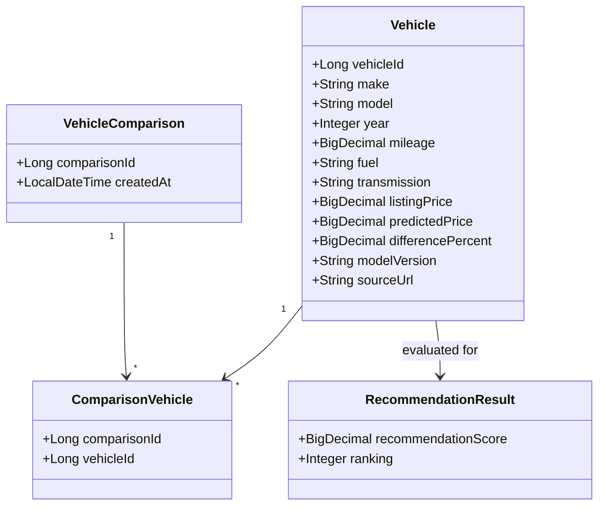

# Class Diagram — Initial Design

This diagram separates the core backend/domain objects from the decision-support
objects. It is an initial design and should be synchronized with Member 01's
Spring Boot package structure.

`RecommendationResult` is a design-level class for Increment 4; the workflow
does not yet define its persistence fields in PostgreSQL.
