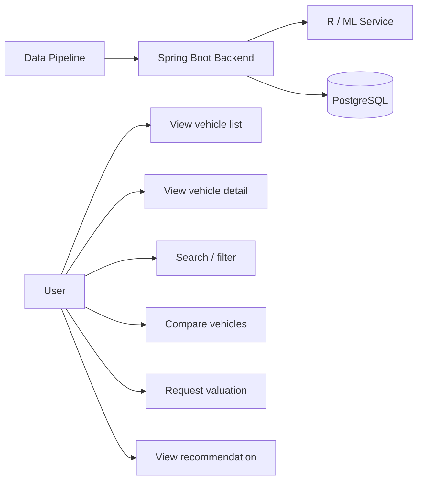

# Use Case — Increment 1 Foundation

## Actors
- **User**: interacts with the decision-support system.
- **Backend System**: exposes application APIs.
- **Data Pipeline**: supplies cleaned/seed vehicle data.
- **R/ML Service**: later supplies predicted prices.

## Initial use cases
1. View vehicle list.
2. View vehicle detail.
3. Search vehicles.
4. Filter vehicles.
5. Compare selected vehicles.
6. Request vehicle valuation.
7. View recommendation result.

The last three are prepared at design level because the workflow places their
implementation mainly in Increment 3–4.

## Main use-case specification: View vehicle detail

**Precondition:** Vehicle exists in the system.

**Main flow**
1. User selects a vehicle.
2. Frontend requests vehicle detail from Spring Boot.
3. Backend reads vehicle data from PostgreSQL.
4. Backend returns JSON.
5. Frontend displays vehicle information.

**Alternative flow**
- Vehicle does not exist → backend returns an appropriate not-found response.

**Postcondition:** User receives the vehicle detail or an error response.
